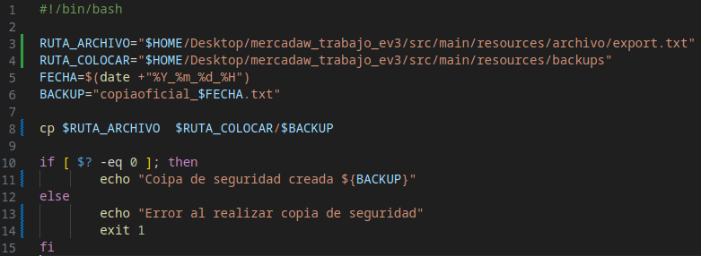
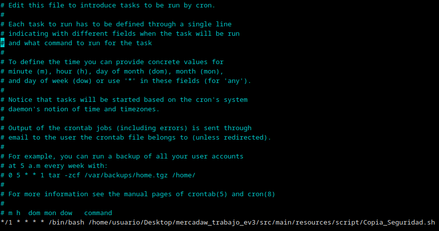

# Práctica obligatoria: Parte de Sistemas

En este documento vamos a documentar la parte de sistemas de la práctica oblitatoria.

## Script
Lo primero es vamos a decir donde se encuentra el Script:
- Ruta : src/main/resources/script/Copia_Seguridad.sh
  
Cuando lo habramos veremos lo siguiente:



Ahora que hemos visto el script completo vamos a desglosar cada linea:

1- Variable para definir la ruta del archivo a copiar
```
RUTA_ARCHIVO="$HOME/Desktop/mercadaw_trabajo_ev3/src/main/resources/ archivo/export.txt"

```


2- Variable para definir la ruta donde se colocará la copia de seguridad 

```
RUTA_COLOCAR="$HOME/Desktop/mercadaw_trabajo_ev3/src/main/resources/backups"

```

3- Varibale para obtener la fecha en el formato "Año_Mes_Día_Hora"
```
FECHA=$(date +"%Y_%m_%d_%H")

```

4- Variable para definir el nombre del archivo de copia de seguridad con la fecha actual
```

BACKUP="copiaoficial_$FECHA.txt" 

```

5- Comando para copiar el archivo a la ruta de copias de seguridad
```
cp $RUTA_ARCHIVO  $RUTA_COLOCAR/$BACKUP

```


6- En el siguiente if:
```
if [ $? -eq 0 ]; then
        echo "Coipa de seguridad creada ${BACKUP}"
else
        echo "Error al realizar copia de seguridad"
        exit 1
fi

```
Se nos ofrece dos posibles resultados
1- Mensaje que nos indica que la copia a sido exitosa junto con el nombre del archivo
2- Mensaje de error si no se puede realizar la copia

## Crontab -e
El Script de arriba funciona perfectamente, pero si se ejcuta con el comando bash, pero nosotros queremos que se ejcute cada x tiempo, para hacer esta prueba vamos a editar crontab -e



Al igual que el script vamos desglosar cada linea

*/1 * * * * /bin/bash /home/usuario/Desktop/mercadaw_trabajo_ev3/src/main/resources/script/Copia_Seguridad.sh

El comando de arriba esta partido en tres partes

1- Parte
```
*/1: Cada minuto.
*: Cada hora.
*: Cada día del mes.
*: Cada mes.
*: Cada día de la semana.

```
2- Parte
```
/bin/bash -> Indicamos con que comandos se ejecutara el script

```

3- Parte
```
/home/usuario/Desktop/mercadaw_trabajo_ev3/src/main/resources/script/Copia_Seguridad.sh ->  Ruta completa al script de copia de seguridad que ejecutaremos

```
